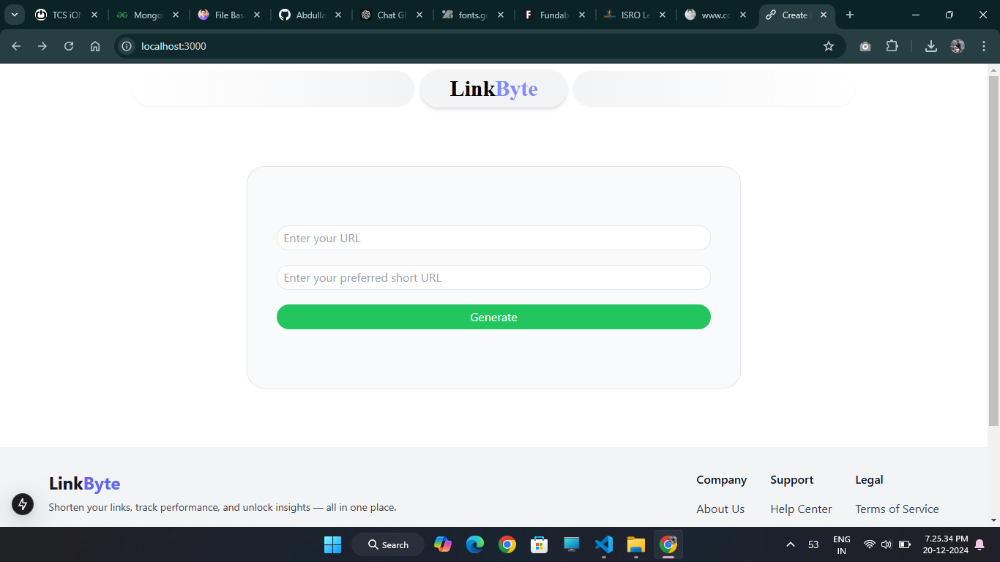
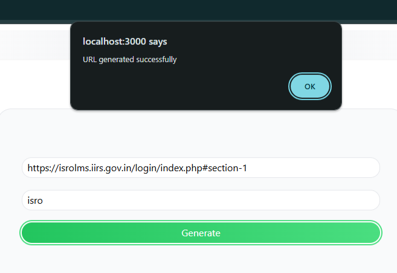
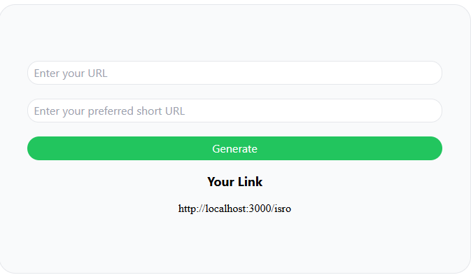

# 🌐 LinkByte

**A Simple and Minimalistic URL Shortener**  

LinkByte allows users to convert long URLs into short, customized links. With a clean interface and straightforward functionality, users can create short links with their preferred alias (if available).  

---

## 🚀 Features
- **Custom Short Links**: Users can provide a preferred short link alias.  
- **Real-Time Availability Check**: Checks if the custom short link is available before saving.  
- **Minimalistic Design**: Clean, simple, and easy-to-use interface.  
- **Full-Stack**: Built using Next.js (frontend + backend) and MongoDB for URL storage.  

---

## 🛠️ Tech Stack
- **Frontend**: Next.js (React-based framework)  
- **Backend**: API routes with Next.js (server-side logic)  
- **Database**: MongoDB (to store URL mappings)  
- **Styling**: Tailwind CSS  

---

## 📸 Screenshots






---


## ⚙️ Installation & Setup

1. **Clone the repository**
   ```bash
   git clone https://github.com/AbdullahShamoon/linkbyte.git
   ```

2. **Navigate to the project folder**

    ```bash
    cd LinkByte
    ```

3. **Install dependencies**

    ```bash
    npm install
    ```

4. **Create a .env.local file and add the following**

    ```makefile
    MONGODB_URI=your_mongodb_connection_string
    ```

5. **Run the development server**

    ```bash
    npm run dev
    ```

6. **Open your browser and visit**

    ```arduino
    http://localhost:3000
    ```

---

## 📦 Usage
- Enter a long URL in the input box.
- Provide a custom short link alias (optional).
- Click "Shorten" to generate the link.
- If the short link is available, it will be saved and displayed for you to copy and use.

---

## 🛠️ Future Enhancements
- Link Analytics: Click tracking, date of creation, and more.
- User Accounts: Let users manage and view their created short links.
- Custom Expiration: Set expiration dates for short links.

---

## 🤝 Contributing
Contributions, issues, and feature requests are welcome